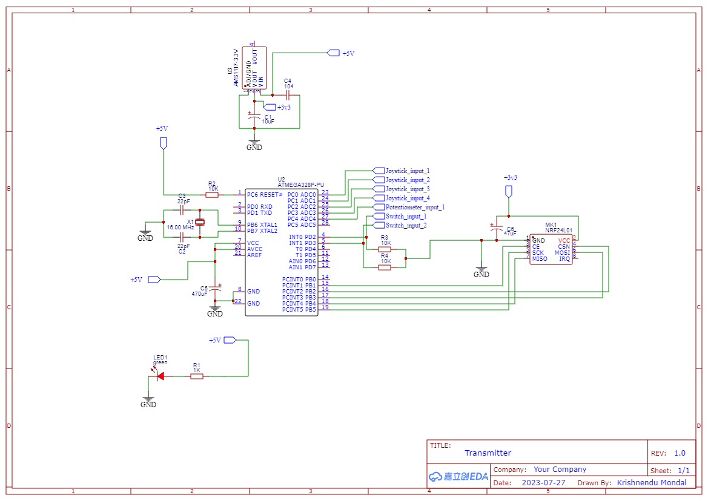
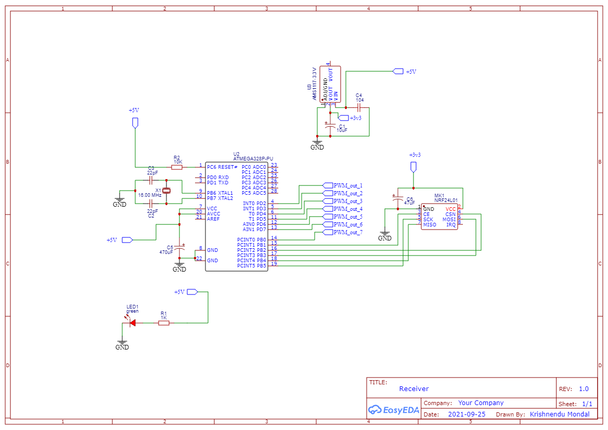

# nRF24L01 & Arduino based radio transmitter and receiver 
&emsp;

## Project description
It's a complete product development, of a cost effective radio transmitter and receiver utilizing Arduino and NRF24 tranceiver module. I started with drawing the schematic, then I did component selection, and after that PCB designing and testing. When the PCB stood out in the process of testing, component assembly, and soldering were done. The enclosure is made up of PVC sheet. The finished product comes out good, also the guaranteed connection range between two module is 600 metres(measured).

## Schematics
### Transmitter
 

### Receiver

## PCB Routing 
I faced design challanges when routing, component placement & positioning, But overall product development project experiance was awesome.

### Transmitter

### Receiver

## 3D view of PCB
### Transmitter

### Receiver

# Final product
## Transmitter
### Inside view

### Outer look

## Receiver
### Top view

### Bottom view

## ARDUINO CODE
Transmitter code <a href="nRF24L01_seven_channel_transmitter_code.ino">here</a>

Receiver code <a href="nRF24L01_seven_channel_receiver_code.ino">here</a>

## Components of Transmitter 
    1. ATmega328pu microcontroller x1
    2. nRF24L01 PA+LNA SMA tranceiver module x1
    3. Copper clad board x1
    4. Complementary components
          a. 28 pin IC base
          b. Joystick x2
          c. Potentiometer x1
          d. SPDT toggle switch x2
          e. Capacitors, Resistors.
## Components of Receiver 
    1. ATmega328pu microcontroller x1
    2. nRF24L01 tranceiver module x1
    3. Copper clad board x1
    3. Complementary components
            a. 28 pin IC base
            b. Header pins
            c. Capacitors, Resistors.
